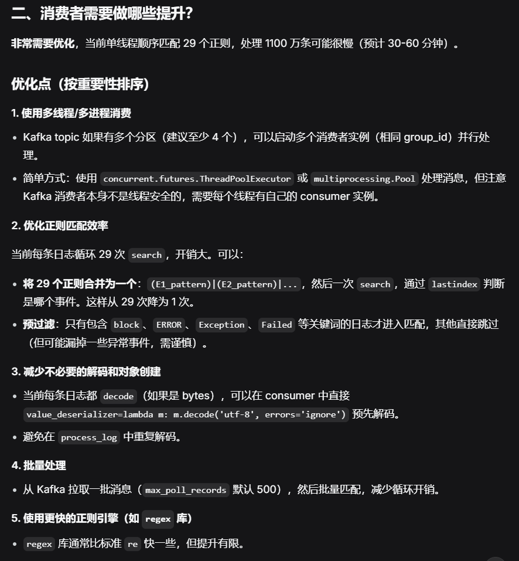
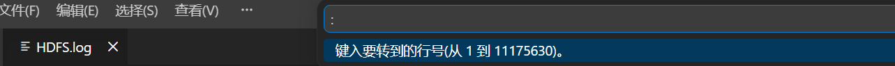

# Kafka 主题管理的完整命令


# 创建一个临时消费者组，让它从最早偏移量开始，然后查看位置
docker exec kafka /opt/kafka/bin/kafka-consumer-groups.sh \
  --bootstrap-server localhost:9092 \
  --group temp-group \
  --reset-offsets --to-earliest --topic hdfs-logs --dry-run






## 5. 查看主题数据（消费者操作）


完整的清空数据流程
bash
# 1. 设置立即过期
docker exec kafka /opt/kafka/bin/kafka-configs.sh \
  --bootstrap-server localhost:9092 \
  --entity-type topics \
  --entity-name hdfs-logs \
  --alter \
  --add-config retention.ms=1

# 2. 等待清理
echo "等待数据清理..."
sleep 5

# 3. 验证数据是否清空
echo "验证数据..."
docker exec kafka /opt/kafka/bin/kafka-console-consumer.sh \
  --bootstrap-server localhost:9092 \
  --topic hdfs-logs \
  --from-beginning \
  --max-messages 1 \
  --timeout-ms 3000 2>&1 | grep -q "Processed a total of 0 messages" && echo "✅ 数据已清空" || echo "⚠️ 仍有数据"

# 4. 恢复保留时间
echo "恢复保留策略..."
docker exec kafka /opt/kafka/bin/kafka-configs.sh \
  --bootstrap-server localhost:9092 \
  --entity-type topics \
  --entity-name hdfs-logs \
  --alter \
  --add-config retention.ms=604800000

# 5. 确认恢复
docker exec kafka /opt/kafka/bin/kafka-configs.sh \
  --bootstrap-server localhost:9092 \
  --entity-type topics \
  --entity-name hdfs-logs \
  --describe | grep retention.ms


### 查看所有消息

```bash
# 从最早的消息开始查看所有数据
docker exec kafka /opt/kafka/bin/kafka-console-consumer.sh \
  --bootstrap-server localhost:9092 \
  --topic <主题名称> \
  --from-beginning
```

### 查看最新消息

```bash
# 只查看最新消息（不显示历史数据）
docker exec kafka /opt/kafka/bin/kafka-console-consumer.sh \
  --bootstrap-server localhost:9092 \
  --topic <主题名称>
```

### 查看指定数量的消息

```bash
# 只查看前10条消息
docker exec kafka /opt/kafka/bin/kafka-console-consumer.sh \
  --bootstrap-server localhost:9092 \
  --topic <主题名称> \
  --from-beginning \
  --max-messages 10
```

### 查看指定分区的消息

```bash
# 查看分区0的消息
docker exec kafka /opt/kafka/bin/kafka-console-consumer.sh \
  --bootstrap-server localhost:9092 \
  --topic <主题名称> \
  --partition 0 \
  --from-beginning
```

### 查看指定偏移量范围的消息

```bash
# 从偏移量10开始查看
docker exec kafka /opt/kafka/bin/kafka-console-consumer.sh \
  --bootstrap-server localhost:9092 \
  --topic <主题名称> \
  --partition 0 \
  --offset 10
```

## 1. 创建主题

### 基础创建

```bash
docker exec kafka /opt/kafka/bin/kafka-topics.sh \
  --create \
  --topic <主题名称> \
  --bootstrap-server localhost:9092 \
  --partitions 3 \
  --replication-factor 1
```

### 带配置创建

```bash
docker exec kafka /opt/kafka/bin/kafka-topics.sh \
  --create \
  --topic <主题名称> \
  --bootstrap-server localhost:9092 \
  --partitions 5 \
  --replication-factor 1 \
  --config retention.ms=86400000 \
  --config retention.bytes=1073741824
```

### 示例

```bash
# 创建名为 hdfs-logs 的主题，3个分区
docker exec kafka /opt/kafka/bin/kafka-topics.sh \
  --create \
  --topic hdfs-logs \
  --bootstrap-server localhost:9092 \
  --partitions 3 \
  --replication-factor 1
```

## 2. 查询所有主题

### 列出所有主题

```bash
docker exec kafka /opt/kafka/bin/kafka-topics.sh \
  --list \
  --bootstrap-server localhost:9092
```

### 列出特定前缀的主题

```bash
docker exec kafka /opt/kafka/bin/kafka-topics.sh \
  --list \
  --bootstrap-server localhost:9092 | grep hdfs
```

## 3. 查看主题详细信息

### 查看主题详情（分区、副本等）

```bash
docker exec kafka /opt/kafka/bin/kafka-topics.sh \
  --describe \
  --topic <主题名称> \
  --bootstrap-server localhost:9092
```

### 查看所有主题详情

```bash
docker exec kafka /opt/kafka/bin/kafka-topics.sh \
  --describe \
  --bootstrap-server localhost:9092
```

### 查看主题配置

```bash
docker exec kafka /opt/kafka/bin/kafka-configs.sh \
  --bootstrap-server localhost:9092 \
  --entity-type topics \
  --entity-name <主题名称> \
  --describe
```

### 查看主题消息数量

```bash
# 获取最新偏移量（总消息数）
docker exec kafka /opt/kafka/bin/kafka-run-class.sh \
  kafka.tools.GetOffsetShell \
  --bootstrap-server localhost:9092 \
  --topic <主题名称> \
  --time -1

# 获取最早偏移量
docker exec kafka /opt/kafka/bin/kafka-run-class.sh \
  kafka.tools.GetOffsetShell \
  --bootstrap-server localhost:9092 \
  --topic <主题名称> \
  --time -2
```

### 示例

```bash
# 查看 hdfs-logs 主题详情
docker exec kafka /opt/kafka/bin/kafka-topics.sh \
  --describe \
  --topic hdfs-logs \
  --bootstrap-server localhost:9092

# 查看 hdfs-logs 主题的消息总数
docker exec kafka /opt/kafka/bin/kafka-run-class.sh \
  kafka.tools.GetOffsetShell \
  --bootstrap-server localhost:9092 \
  --topic hdfs-logs \
  --time -1
```

## 4. 删除主题

### 删除指定主题


# 1. 先尝试正常删除
```shell
docker exec kafka /opt/kafka/bin/kafka-topics.sh \
  --delete \
  --topic hdfs-logs \
  --bootstrap-server localhost:9092

```


# 2. 查看主题状态（应该显示 marked for deletion）
```shell
docker exec kafka /opt/kafka/bin/kafka-topics.sh \
  --describe \
  --topic hdfs-logs \
  --bootstrap-server localhost:9092

```


```bash
docker exec kafka /opt/kafka/bin/kafka-topics.sh \
  --delete \
  --topic <主题名称> \
  --bootstrap-server localhost:9092
```

### 强制删除（删除数据目录）

```bash
# 删除主题数据目录
docker exec kafka rm -rf /tmp/kraft-combined-logs/<主题名称>-*

# 重启 Kafka
docker restart kafka
```

### 批量删除

```bash
# 删除所有以 hdfs 开头的主题
for topic in $(docker exec kafka /opt/kafka/bin/kafka-topics.sh --list --bootstrap-server localhost:9092 | grep hdfs); do
    echo "删除主题: $topic"
    docker exec kafka /opt/kafka/bin/kafka-topics.sh \
      --delete \
      --topic $topic \
      --bootstrap-server localhost:9092
done
```

### 示例

```bash
# 删除 hdfs-logs 主题
docker exec kafka /opt/kafka/bin/kafka-topics.sh \
  --delete \
  --topic hdfs-logs \
  --bootstrap-server localhost:9092

# 验证删除
docker exec kafka /opt/kafka/bin/kafka-topics.sh \
  --list \
  --bootstrap-server localhost:9092
```