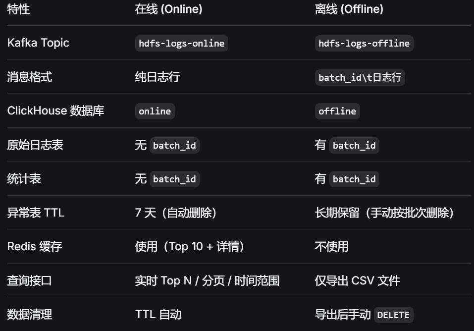
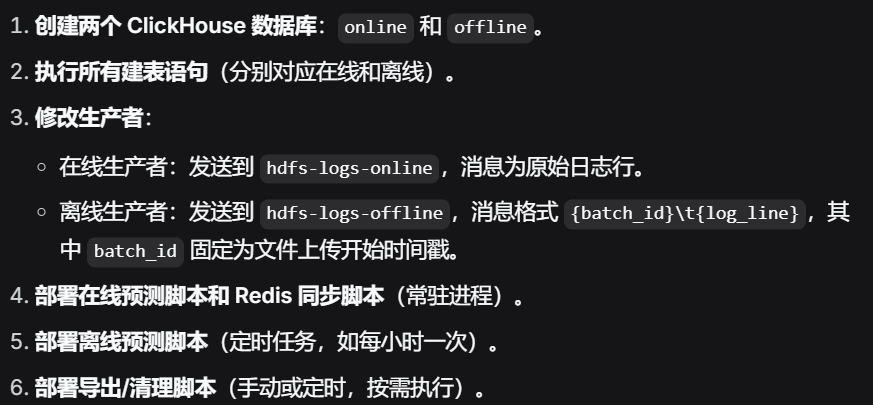

# 本方案将系统拆分为两个完全独立的模块：

-  在线实时分析：处理持续不断的实时日志流，提供毫秒级异常查询（Top N、分页），使用 Redis 缓存热点数据，ClickHouse 异常表自动 TTL 滑动窗口。
 
-  离线批处理：处理批量上传的完整日志文件，按批次统计、预测异常、导出 CSV 文件并清理数据，不依赖 Redis，数据长期保留或按批次手动删除。

-  两者使用不同的 Kafka Topic、不同的 ClickHouse 数据库、不同的表结构（离线表携带 batch_id），互不干扰。

# 整体架构图
```text
在线实时流                          离线批处理
─────────────────                  ─────────────────
Kafka: hdfs-logs-online            Kafka: hdfs-logs-offline
       │                                   │
       ▼                                   ▼
ClickHouse 数据库 online            ClickHouse 数据库 offline
  ├─ kafka_hdfs_logs                 ├─ kafka_hdfs_logs (带 batch_id)
  ├─ hdfs_logs                       ├─ hdfs_logs (带 batch_id)
  ├─ mv_hdfs_logs (物化视图)          ├─ mv_hdfs_logs (解析 batch_id)
  ├─ block_event_stats               ├─ block_event_stats (带 batch_id)
  ├─ mv_block_stats (统计视图)        ├─ mv_block_stats (统计视图，带 batch_id)
  └─ anomaly_blocks (TTL 7天)        └─ anomaly_blocks (带 batch_id，长期保留)
       │                                   │
       ▼                                   ▼
  Redis 增量同步 (Top N + 详情)        按批次导出 CSV + 清理数据

```


# 对比总结


# 五、实施步骤


### 这样，你就获得了一个完全分离、健壮可扩展的持久化体系，同时支持实时监控和离线批处理。