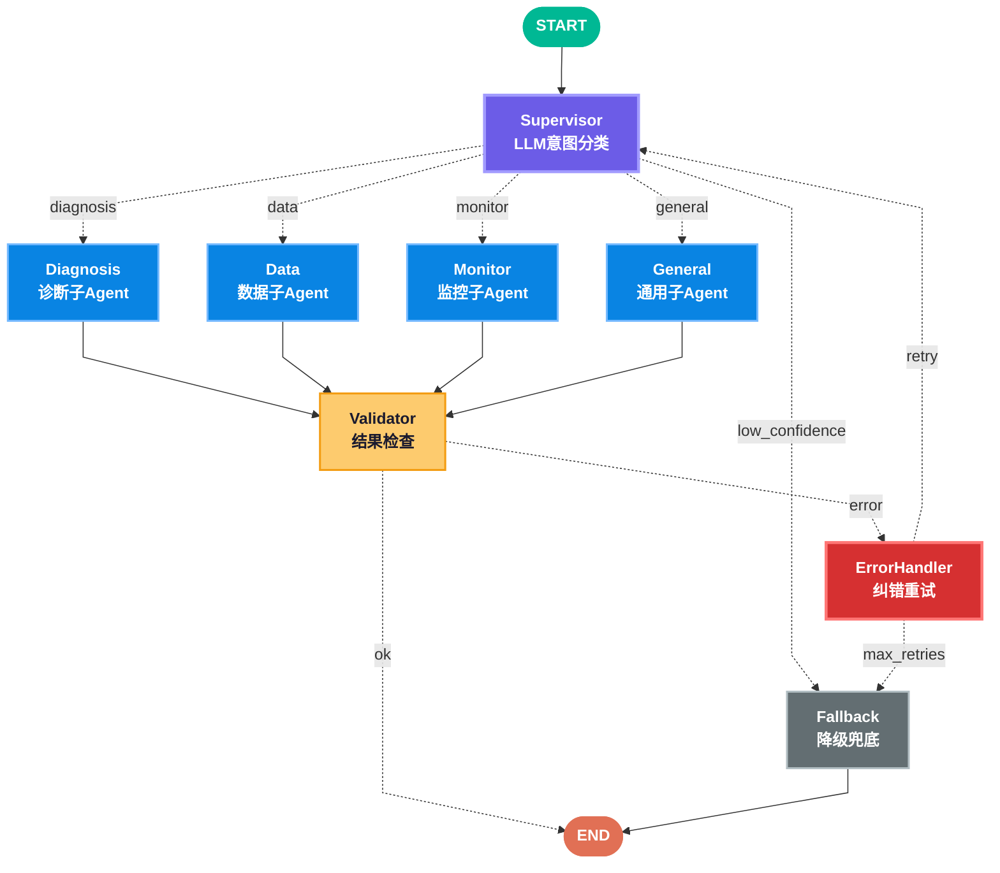

```mermaid
---
config:
  flowchart:
    curve: linear
---
graph TD
    __start__([START]):::first
    supervisor[Supervisor<br/>LLM意图分类]
    diagnosis_agent[Diagnosis<br/>诊断子Agent]
    data_agent[Data<br/>数据子Agent]
    monitor_agent[Monitor<br/>监控子Agent]
    general_agent[General<br/>通用子Agent]
    result_validator[Validator<br/>结果检查]
    error_handler[ErrorHandler<br/>纠错重试]
    fallback[Fallback<br/>降级兜底]
    __end__([END]):::last

    __start__ --> supervisor
    supervisor -.->|diagnosis| diagnosis_agent
    supervisor -.->|data| data_agent
    supervisor -.->|monitor| monitor_agent
    supervisor -.->|general| general_agent
    supervisor -.->|low_confidence| fallback

    diagnosis_agent --> result_validator
    data_agent --> result_validator
    monitor_agent --> result_validator
    general_agent --> result_validator

    result_validator -.->|ok| __end__
    result_validator -.->|error| error_handler

    error_handler -.->|retry| supervisor
    error_handler -.->|max_retries| fallback

    fallback --> __end__

    classDef default fill:#1a1a2e,color:#fff,stroke:#e94560,stroke-width:2px,font-weight:bold
    classDef first fill:#00b894,color:#fff,stroke:#00b894,stroke-width:2px,font-weight:bold
    classDef last fill:#e17055,color:#fff,stroke:#e17055,stroke-width:2px,font-weight:bold
    classDef supervisor fill:#6c5ce7,color:#fff,stroke:#a29bfe,stroke-width:3px,font-weight:bold
    classDef agent fill:#0984e3,color:#fff,stroke:#74b9ff,stroke-width:2px,font-weight:bold
    classDef validator fill:#fdcb6e,color:#1a1a2e,stroke:#f39c12,stroke-width:2px,font-weight:bold
    classDef error fill:#d63031,color:#fff,stroke:#ff7675,stroke-width:3px,font-weight:bold
    classDef fallback fill:#636e72,color:#fff,stroke:#b2bec3,stroke-width:2px,font-weight:bold

    class supervisor supervisor
    class diagnosis_agent,data_agent,monitor_agent,general_agent agent
    class result_validator validator
    class error_handler error
    class fallback fallback
```
